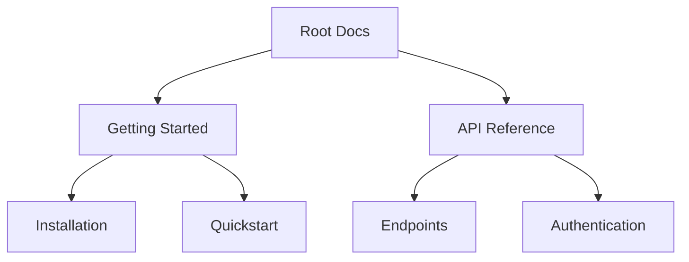

## Overview

CompareTech provides robust tools for managing your documentation effectively. You organize content into hierarchical structures, collaborate seamlessly with teams, search quickly across pages, and track changes with version control. These features ensure your docs stay current and accessible.

<Columns cols={2}>
  <Card title="Document Hierarchy" icon="layout" href="#document-organization">
    Build nested page structures for intuitive navigation.
  </Card>
  <Card title="Collaboration" icon="users" href="#collaboration">
    Edit, review, and merge changes in real-time.
  </Card>
  <Card title="Search & Navigation" icon="search" href="#search-navigation">
    Find content instantly with smart search.
  </Card>
  <Card title="Version Control" icon="git-branch" href="#version-control">
    Track history and revert changes easily.
  </Card>
</Columns>

## Document Organization and Hierarchy

You create a clear hierarchy with parent-child pages, folders, and sections. This mirrors your project's structure, making navigation intuitive.



Use the sidebar to drag and drop pages. Nest up to five levels deep for complex projects.

<Callout kind="tip">
  Start with broad categories at the top level, then drill down into specifics.
</Callout>

## Collaboration Tools

Invite team members to co-edit docs. Features include real-time cursors, comments, and @mentions.

<Tabs>
  <Tab title="Review Workflow" icon="eye">
    Assign reviewers and track approvals.
    
    <Steps>
      <Step title="Draft" icon="edit-3">
        Create and share your page.
      </Step>
      <Step title="Review" icon="check-circle">
        Add comments and suggestions.
      </Step>
      <Step title="Merge" icon="git-merge">
        Publish approved changes.
      </Step>
    </Steps>
  </Tab>
  <Tab title="Permissions" icon="shield">
    Set roles: Viewer, Editor, Admin.
    
    | Role    | Edit Pages | Manage Users | Delete Content |
    |---------|------------|--------------|----------------|
    | Viewer  | No         | No           | No             |
    | Editor  | Yes        | No           | No             |
    | Admin   | Yes        | Yes          | Yes            |
  </Tab>
</Tabs>

## Search and Navigation Features

Search indexes all content, including code blocks and headings. Use filters for pages, sections, or tags.

<Expandable title="Advanced Search Tips" default-open="false">
  Combine keywords: `API + authentication`.
  
  Navigate with breadcrumbs and table of contents that auto-generates from headings.
</Expandable>

## Version Control Basics

Track every change with built-in Git integration. View diffs, revert commits, and branch for experiments.

<CodeGroup tabs="CLI,API">
  ````bash
  # Pull latest changes
  ct pull docs/
  
  # Commit new page
  ct commit -m "Add API guide" -p api-guide.mdx
  
  # Push to remote
  ct push origin main
  ````
  ```javascript
  // Fetch version history via API
  const history = await fetch('https://api.comparetech.com/docs/project/versions', {
    headers: { Authorization: `Bearer YOUR_API_KEY` }
  });
  const data = await history.json();
  console.log(data.commits);
  ```
</CodeGroup>

<Callout kind="info">
  Enable version control in project settings to start tracking changes automatically.
</Callout>

These core features empower you to maintain professional, scalable documentation. Explore each in depth to optimize your workflow.