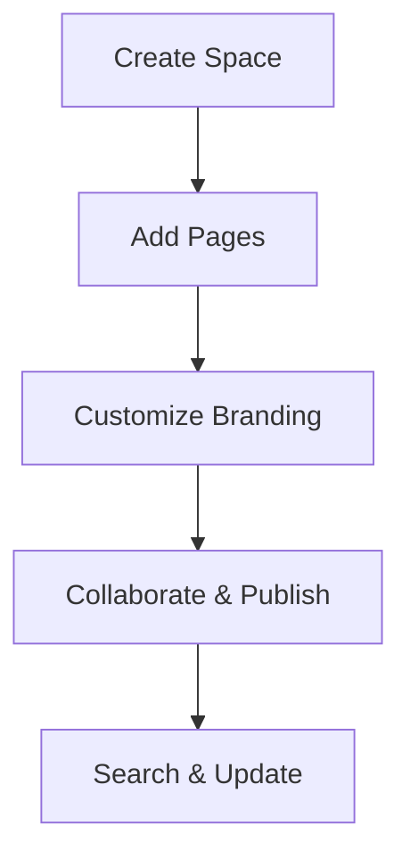

## Overview

CompareTech Documentation provides a centralized platform where you organize, manage, and collaborate on all your project documentation. You create structured spaces for technical guides, API references, and user manuals with seamless version control and search capabilities. Access everything from a single dashboard, ensuring your team stays aligned without scattered files.

<Callout kind="info">
CompareTech uses the brand color `#3B82F6` across all UI elements for consistency.
</Callout>

## Key Benefits

You gain efficiency with CompareTech's powerful features. Explore the main benefits below.

<Columns cols={3}>
  <Card title="Centralized Organization" icon="folder" href="#">
    Keep all docs in one place. No more hunting through drives or repositories.
  </Card>
  <Card title="Real-time Collaboration" icon="users" href="#">
    Edit simultaneously with teammates. Changes sync instantly.
  </Card>
  <Card title="Advanced Search" icon="search" href="#">
    Find content quickly with full-text search and tags.
  </Card>
</Columns>

## Use Cases

CompareTech fits various scenarios. Select your primary use case to see tailored examples.

<Tabs>
  <Tab title="API Documentation" icon="code">
    Document your REST or GraphQL APIs with interactive examples.

    <CodeGroup tabs="JavaScript,Python">
      ```javascript
      const response = await fetch('https://api.comparetech.com/v1/docs', {
        headers: { 'Authorization': 'Bearer YOUR_API_KEY' }
      });
      const docs = await response.json();
      console.log(docs);
      ```
      ```python
      import requests
      response = requests.get(
        'https://api.comparetech.com/v1/docs',
        headers={'Authorization': 'Bearer YOUR_API_KEY'}
      )
      docs = response.json()
      print(docs)
      ```
    </CodeGroup>
  </Tab>
  <Tab title="User Guides" icon="book-open">
    Build step-by-step tutorials for your products.

    <Image
      src="https://via.placeholder.com/800x400/3B82F6/FFFFFF?text=User+Guide+Screenshot"
      alt="Screenshot of a CompareTech user guide page"
      width="800"
      height="400"
    />
  </Tab>
  <Tab title="Changelogs" icon="git-branch">
    Maintain version histories with structured updates.
  </Tab>
</Tabs>

## Getting Oriented

Follow these steps to start using CompareTech effectively.

<Steps>
  <Step title="Create Your Space" icon="plus">
    Log in and click "New Space". Name it for your project, like "Project Alpha Docs".
  </Step>
  <Step title="Add Content" icon="file-plus">
    Upload Markdown files or create new pages directly in the editor.
  </Step>
  <Step title="Customize Theme" icon="palette">
    Set your primary color to `#3B82F6` in Space Settings > Branding.
  </Step>
  <Step title="Invite Team" icon="user-plus">
    Share the space link with collaborators and assign roles.
  </Step>
</Steps>

## Brand Guidelines

<Expandable title="Detailed Brand Guidelines" default-open="false">

Adhere to these rules for consistent branding.

- **Primary Color**: `#3B82F6` – Use for buttons, links, and accents.
- **Typography**: Sans-serif fonts like Inter or system defaults.
- **Icons**: Lucide icon set for all UI elements.

| Element       | Color Value    | Usage                  |
|---------------|----------------|------------------------|
| Primary       | `#3B82F6`     | CTAs, active states   |
| Secondary     | `#1E40AF`     | Hover states          |
| Background    | `#FFFFFF`     | Main content areas    |
| Text          | `#1F2937`     | Body and headings     |

Avoid using the primary color for text to maintain readability.

</Expandable>



This setup ensures you build professional documentation spaces quickly. Dive in and organize your projects today.