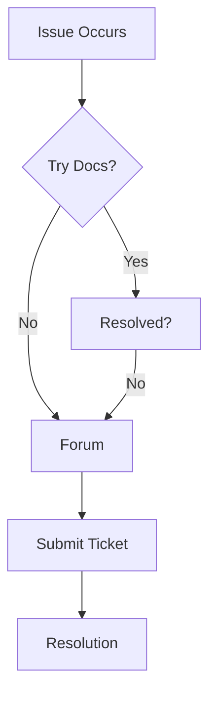

## Access and Permission Errors

You encounter access errors when your account lacks necessary permissions or sessions expire. Common messages include `403 Forbidden` or `Permission Denied`.

<Callout kind="alert">
  Always verify your role in the workspace before troubleshooting further.
</Callout>

<Tabs>
  <Tab title="Role Assignment" icon="users">
    Check your assigned role matches the required permissions.

    <Steps>
      <Step title="Navigate to Settings" icon="settings">
        Go to your workspace settings via the sidebar.
      </Step>
      <Step title="Review Members" icon="eye">
        Select **Members** and locate your profile.
      </Step>
      <Step title="Update Role" icon="edit-3">
        Assign `Editor` or `Admin` as needed and save changes.
      </Step>
    </Steps>
  </Tab>
  <Tab title="Session Refresh" icon="refresh-cw">
    Expired sessions cause intermittent access issues.

    ```bash
    # Clear browser cache and cookies for CompareTech
    # Then log in again
    ```
    
    Or force refresh your authentication token:

    <CodeGroup tabs="JavaScript,cURL">
    ```javascript
    // Update token via API
    const newToken = await fetch('https://api.comparetech.com/auth/refresh', {
      method: 'POST',
      headers: { 'Authorization': `Bearer ${YOUR_REFRESH_TOKEN}` }
    }).then(res => res.json());
    localStorage.setItem('token', newToken.access_token);
    ```
    ```bash
    curl -X POST https://api.comparetech.com/auth/refresh \
      -H "Authorization: Bearer YOUR_REFRESH_TOKEN" \
      -d '{}'
    ```
    </CodeGroup>
  </Tab>
</Tabs>

## Content Syncing Issues

Sync failures occur during large uploads or network interruptions. Look for `Sync Failed` or `Upload Timeout` notifications.

<Columns cols={2}>
  <Card title="Check Network" icon="wifi" href="#">
    Verify stable connection and retry sync.
  </Card>
  <Card title="File Limits" icon="file-text" href="#">
    Ensure files under `10MB` and fewer than `50` per batch.
  </Card>
</Columns>

### Quick Fix Steps

<Steps>
  <Step title="Pause Sync" icon="pause">
    Pause ongoing syncs in the dashboard.
  </Step>
  <Step title="Clear Queue" icon="trash-2">
    ```javascript
    // Via browser console in CompareTech dashboard
    window.CompareTech.clearSyncQueue();
    ```
  </Step>
  <Step title="Resume Sync" icon="play">
    Resume and monitor progress.
  </Step>
</Steps>

<Expandable title="Advanced Sync Diagnostics" default-open="false">
  Enable debug logging:

  ```json
  {
    "sync": {
      "debug": true,
      "logLevel": "verbose"
    }
  }
  ```

  Check console for errors like `{code: "NETWORK_ERROR", details: "..."}`.
</Expandable>

## Performance Optimization Tips

Slow loading affects large workspaces. Optimize by reducing media embeds and enabling caching.

| Issue | Symptom | Quick Fix |
|-------|---------|-----------|
| Slow Page Loads | `>5s` render time | Compress images `<2MB` |
| High CPU Usage | Dashboard lags | Limit open tabs to `<10` |
| Search Delays | Queries take `>2s` | Index new content nightly |

<Callout kind="tip">
  Run performance audits weekly using browser dev tools.
</Callout>

## Support Resources

Contact support for unresolved issues.

<Columns cols={3}>
  <Card title="Documentation" icon="book-open" href="/docs" cta="Browse Docs">
    Search existing guides first.
  </Card>
  <Card title="Community Forum" icon="message-circle" href="https://forum.comparetech.com" target="_blank" cta="Ask Question">
    Get peer help quickly.
  </Card>
  <Card title="Submit Ticket" icon="help-circle" href="https://support.comparetech.com" target="_blank" cta="Open Ticket">
    Direct assistance from team.
  </Card>
</Columns>



For urgent matters, email `support@comparetech.com` with logs and screenshots.